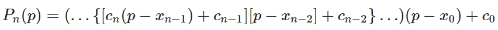
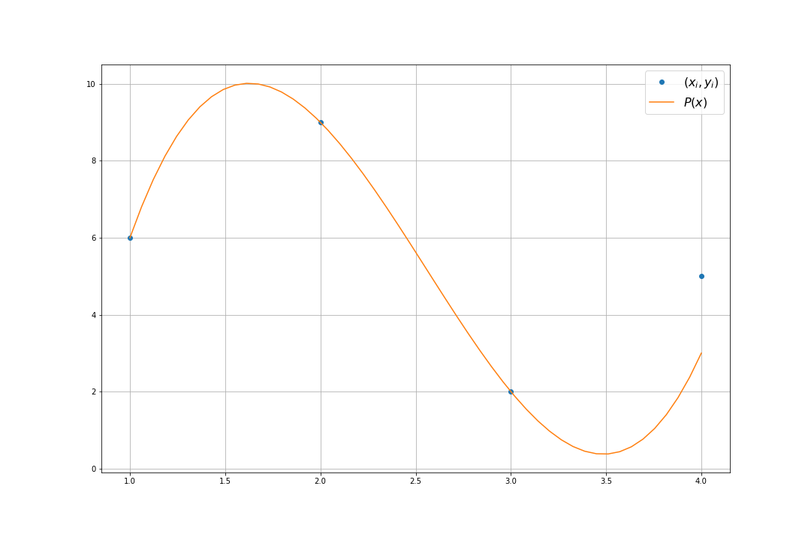

To solve Newton's divided differences interpolation polynomial, we use the compact form:



As it is faster than the normal form, although it may be slightly less elegant. In this equation, **c** are the Newton coefficients, calculated using the Divided differences method; **x** are the data points that we have, and **p** is a point we want to evaluate.

In our example, first we calculate the Newton coefficients for some data points (x,y):

```
import numpy as np
from Newton import newton_coefs, newton_compact, graf

WID = 15
HEI =10

x = np.array([1,2,3,4])
y = np.array([6,9,2,5])

c = newton_coefs(x, y)
print(c)
```
```
[ 6  3 -5  3]
```

The points we want to evaluate are all the points inside the space of **x**:

```
p = np.linspace(np.min(x), np.max(x))
pol = newton_compact(c, x, p)

graf(x,y,p,pol, WID, HEI)
```



